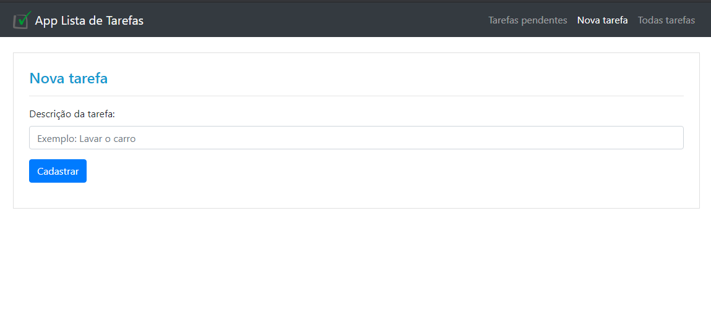
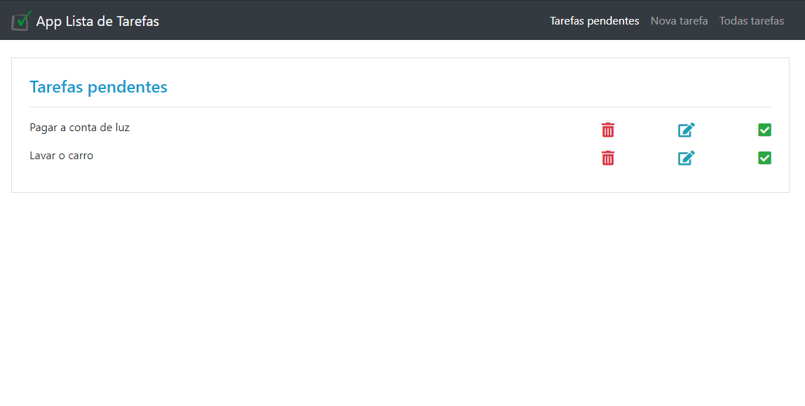
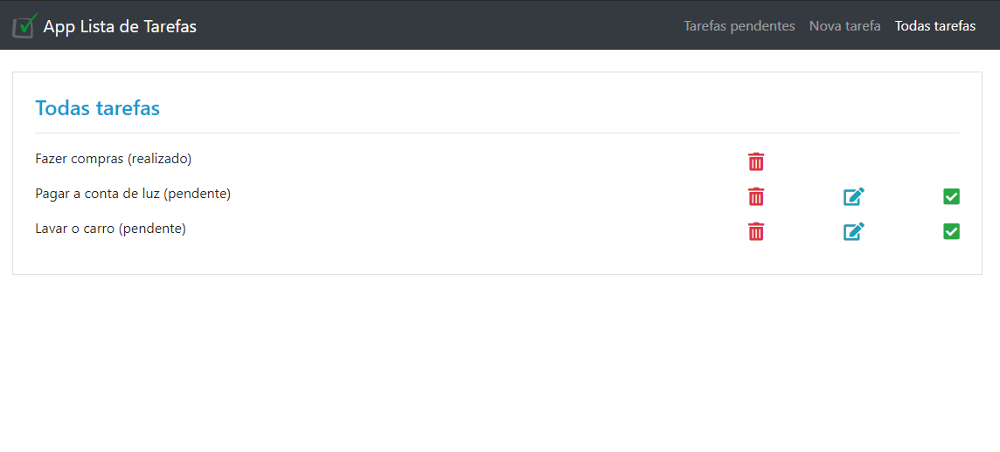

<h1 align="center">To-Do List</h1>

  

<h3 align="center">
  :heavy_check_mark: Status: Finished Project :rocket:
</h3>

 <a href="#about">About</a> •
 <a href="#purpose">Purpose</a> •
 <a href="#features">Features</a> •
 <a href="#layout">Layout</a> • 
 <a href="#how-it-works">How it works</a> • 
 <a href="#tech-stack">Tech Stack</a> • 
 <a href="#author">Author</a> • 
 <a href="#user-content-license">License</a>

## :computer: About 

  The application consists of registering tasks to be done that can be accessed
  through the tab "Pending tasks" where the respective tasks will be listed
  not completed and can also be accessed through the "All Tasks" tab
  where all tasks completed or not will be listed. Tasks can
  be completed, updated, even deleted.

## :dart: Purporse 

  The To-Do List project aims to apply the concepts studied
  using the PHP language with communication between the MySQL database.

## :gear: Features

- [x] Task Registration
- [x] Listing of Pending Tasks
  - Mark Completed
  - Task Edit
  - Task Delete
- [x] Listing of All Tasks
  - Mark Completed
  - Task Edit
  - Task Delete

## :art: Layout

<h3 align="center">Task registration</h3>
<h4 align="center">
  
</h4>

<h3 align="center">listing of pending tasks</h3>
<h4 align="center">
   
</h4>

<h3 align="center">Listing of all tasks</h3>
<h4 align="center">
   
</h4>

## 🛠 Tech Stack

The following tools were used in the construction of the project:

### Website

-   
-   
-   
-   
-   
-   

### Utilities

-   Editor:  **[Visual Studio Code](https://code.visualstudio.com/)**
-   Icons:  **[Font Awesome](https://fontawesome.com/)**
